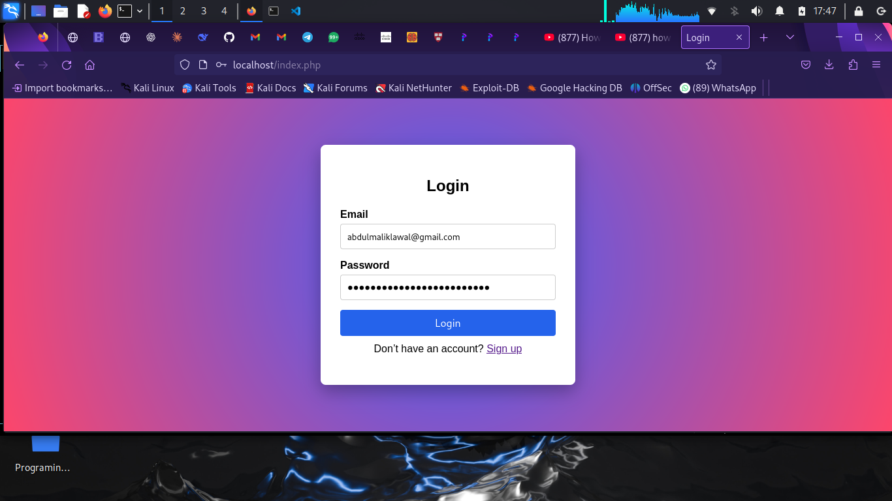
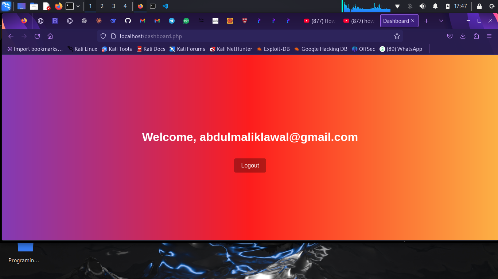
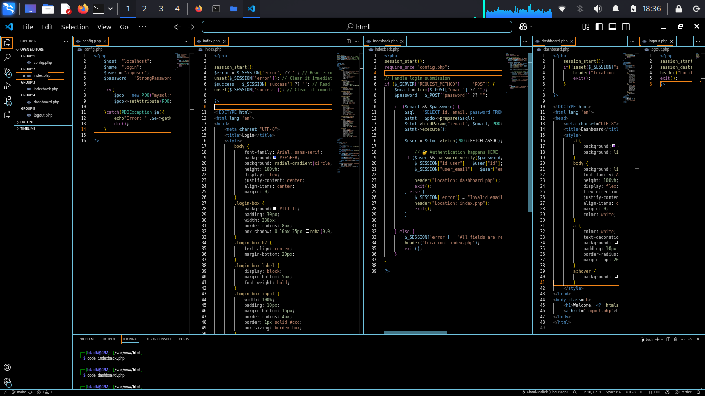
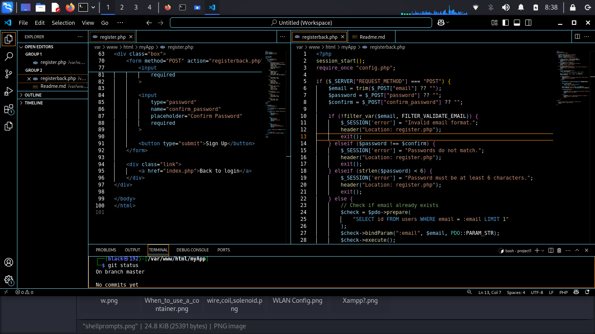

# 🔐 PHP Authentication System — Day 1

This repository documents my step-by-step backend journey, starting with the fundamentals of authentication using PHP sessions.

This README covers Day 1 only, strictly based on what is currently implemented and shown in the screenshots.

## 📅 Day 1 — Session-Based Login System
### 🎯 Goal

Understand how authentication works on the backend using PHP:

Sessions

Login flow

Protected pages

Logout handling

## ✅ What Was Implemented (Day 1)
### 1️⃣ Login Page (index.php)

A login form with:

Email field

Password field

Clean, centered UI with a gradient background

PHP session started at the top of the file

Displays feedback messages using session variables

### 2️⃣ Session Handling

Sessions are initialized using:

session_start();

User email is stored in $_SESSION after successful login

Session data is used to control access to pages

### 3️⃣ Authentication Logic

User credentials are checked on form submission

If credentials are valid:

User is redirected to the dashboard

If credentials are invalid:

An error message is stored in the session

### 4️⃣ Protected Dashboard (dashboard.php)

Dashboard page is only accessible after login

Displays a personalized welcome message:

Welcome, user@email.com

Contains a Logout button

### 5️⃣ Logout System (logout.php)

Logout destroys the session using:

session_destroy();

User is redirected back to the login page

Prevents access to dashboard after logout

### 6️⃣ Database Configuration (config.php)

Database connection established using PDO

Credentials stored in a separate configuration file

Errors handled with try...catch

## 🗂️ Project Structure (Day 1)
/project-root
│
├── config.php        # PDO database connection
├── index.php         # Login page
├── dashboard.php     # Protected page (session-based)
├── logout.php        # Session destruction
└── README.md

## 🖼️ Screenshots (Day 1)
Login Page

Dashboard After Login

Codespace (PHP + Sessions)

📌 Screenshots reflect the exact state of the project at Day 1.

## 🛠️ Tech Used (Day 1 Only)

PHP

PHP Sessions

MySQL (PDO)

HTML & CSS

Apache (Localhost)

## 📌 Key Takeaways (Day 1)

Authentication starts with session control

Backend logic decides access — not the UI

Sessions persist state across requests

Logout is just as important as login

## 🔜 What Comes Next (Not Implemented Yet)

These are not part of Day 1:

Password hashing

Database-driven users table

Registration system

Security hardening

Middleware / MVC

They will be introduced incrementally in future days.

👤 Author

# 🔐 PHP Authentication System — Day 2
## 📅 Day 2 — User Registration & Password Security
## 🎯 Focus

Build a proper user registration flow and introduce basic security practices for handling user credentials.

## ✅ What Was Implemented (Day 2)

### 👉 A dedicated registration page (register.php) with:

Email input

Password and confirm-password fields

### 👉 Server-side validation to ensure:

Valid email format

Matching passwords

Minimum password length

### 👉 Prevention of duplicate accounts by checking if an email already exists

### 👉 Secure password storage using:

password_hash()

### 👉 Database operations handled with PDO prepared statements

### 👉 Session-based error and success messages for user feedback

### 👉 Clear redirect flow between registration and login pages

## 🖼️ Screenshots (Day 2)
Codespace 

Different output based on conditions

## 🧠 Key Takeaways (Day 2)

This stage introduced real backend responsibilities:

Validating user input on the server

Protecting user credentials

Enforcing data integrity before database writes

Managing user feedback using sessions

### Registration is more than a form — it’s the first layer of application security.

