# 🔐 PHP Authentication System — Day 1

This repository documents my step-by-step backend journey, starting with the fundamentals of authentication using PHP sessions.

This README covers Day 1 only, strictly based on what is currently implemented and shown in the screenshots.

## 📅 Day 1 — Session-Based Login System
### 🎯 Goal

Understand how authentication works on the backend using PHP:

Sessions

Login flow

Protected pages

Logout handling

## ✅ What Was Implemented (Day 1)
### 1️⃣ Login Page (index.php)

A login form with:

Email field

Password field

Clean, centered UI with a gradient background

PHP session started at the top of the file

Displays feedback messages using session variables

### 2️⃣ Session Handling

Sessions are initialized using:

session_start();

User email is stored in $_SESSION after successful login

Session data is used to control access to pages

### 3️⃣ Authentication Logic

User credentials are checked on form submission

If credentials are valid:

User is redirected to the dashboard

If credentials are invalid:

An error message is stored in the session

### 4️⃣ Protected Dashboard (dashboard.php)

Dashboard page is only accessible after login

Displays a personalized welcome message:

Welcome, user@email.com

Contains a Logout button

### 5️⃣ Logout System (logout.php)

Logout destroys the session using:

session_destroy();

User is redirected back to the login page

Prevents access to dashboard after logout

### 6️⃣ Database Configuration (config.php)

Database connection established using PDO

Credentials stored in a separate configuration file

Errors handled with try...catch

## 🗂️ Project Structure (Day 1)
/project-root
│
├── config.php        # PDO database connection
├── index.php         # Login page
├── dashboard.php     # Protected page (session-based)
├── logout.php        # Session destruction
└── README.md

## 🖼️ Screenshots (Day 1)
Login Page
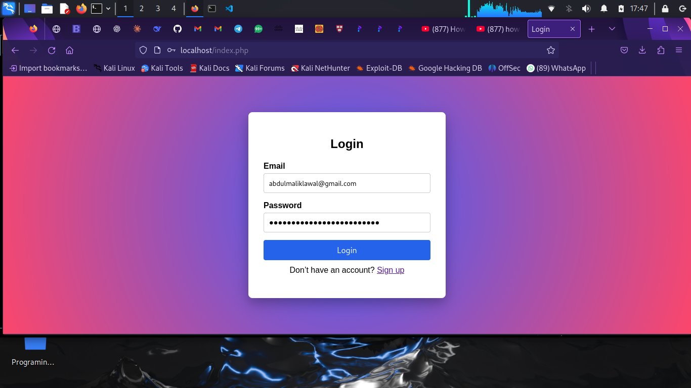

Dashboard After Login
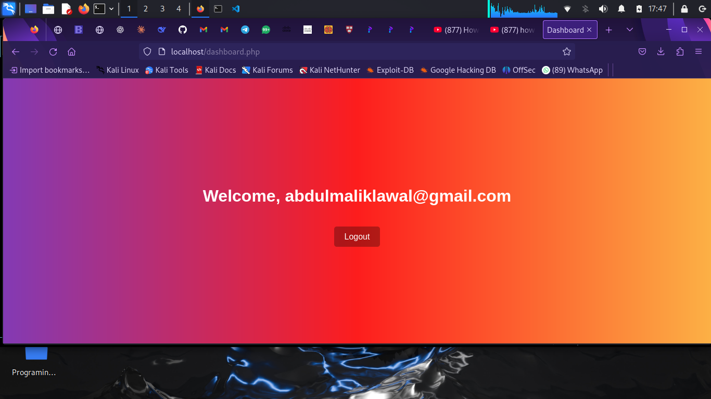

Codespace (PHP + Sessions)
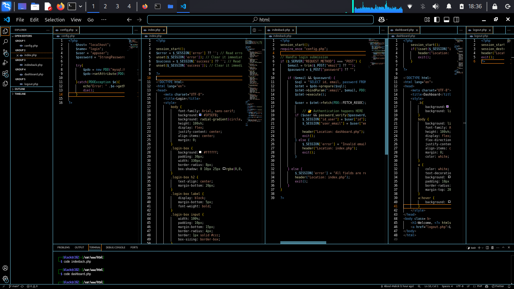

📌 Screenshots reflect the exact state of the project at Day 1.

## 🛠️ Tech Used (Day 1 Only)

PHP

PHP Sessions

MySQL (PDO)

HTML & CSS

Apache (Localhost)

## 📌 Key Takeaways (Day 1)

Authentication starts with session control

Backend logic decides access — not the UI

Sessions persist state across requests

Logout is just as important as login

## 🔜 What Comes Next (Not Implemented Yet)

These are not part of Day 1:

Password hashing

Database-driven users table

Registration system

Security hardening

Middleware / MVC

They will be introduced incrementally in future days.

👤 Author

# 🔐 PHP Authentication System — Day 2
## 📅 Day 2 — User Registration & Password Security
## 🎯 Focus

Build a proper user registration flow and introduce basic security practices for handling user credentials.

## ✅ What Was Implemented (Day 2)

### 👉 A dedicated registration page (register.php) with:

Email input

Password and confirm-password fields

### 👉 Server-side validation to ensure:

Valid email format

Matching passwords

Minimum password length

### 👉 Prevention of duplicate accounts by checking if an email already exists

### 👉 Secure password storage using:

password_hash()

### 👉 Database operations handled with PDO prepared statements

### 👉 Session-based error and success messages for user feedback

### 👉 Clear redirect flow between registration and login pages

## 🖼️ Screenshots (Day 2)
Codespace 
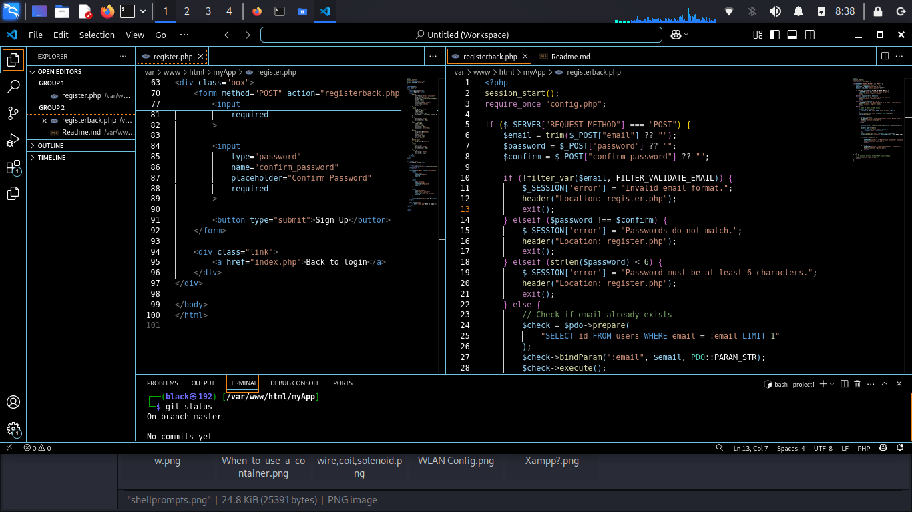

Different output based on conditions

## 🧠 Key Takeaways (Day 2)

This stage introduced real backend responsibilities:

Validating user input on the server

Protecting user credentials

Enforcing data integrity before database writes

Managing user feedback using sessions

### Registration is more than a form — it’s the first layer of application security.

# 🔐 PHP Authentication System — Day 3
## 📅 Day 2 — Email Verification System
## 🎯 Goal

Implement secure email verification to ensure only valid users can activate their accounts after registration.

## 🛠️ What was implemented

👉Token-based email verification

Verification token is received via URL (verify.php?token=...)

Token is securely checked against the database using prepared statements (PDO)

👉Validation checks

-Invalid or missing token handling

-Already verified account detection

-Token expiration check using timestamps

👉Account activation

-Marks user as verified (is_verified = 1)

-Clears verification token and expiration fields after success

👉Session feedback

-Success message stored in session for login flow

👉User feedback UI

-Dynamic success, error, and info states

-Clean verification page with visual indicators and clear messages

## 🔐 Key concepts learned

-Secure token validation

-Time-based token expiration

-Email verification logic

-Defensive backend programming

-Separation of authentication states (registered vs verified)

## 📂 Files involved

-verify.php

-Database users table (verification token & expiry fields)

## 🖼️ Screenshots (Day 3)
Codespace 
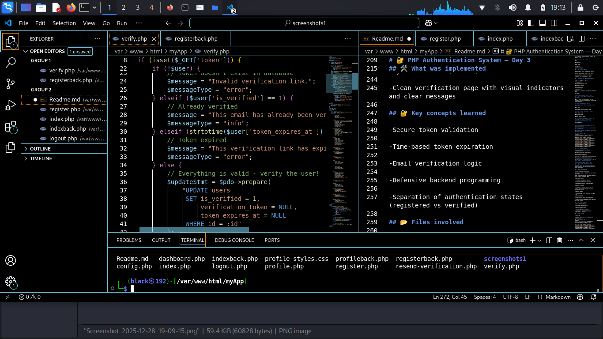

Different output based on conditions
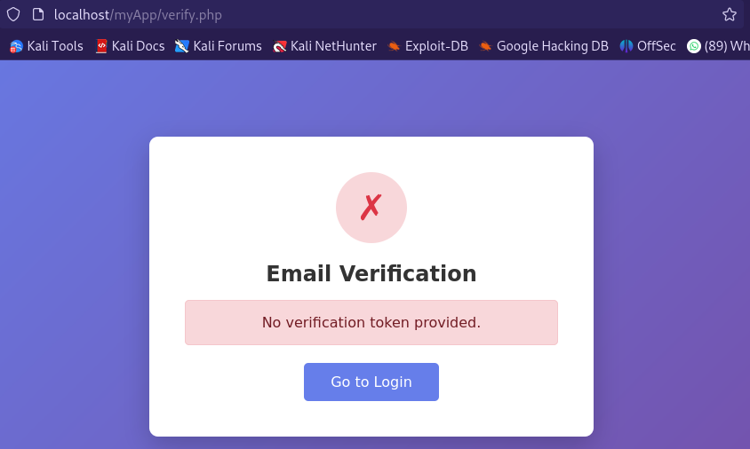
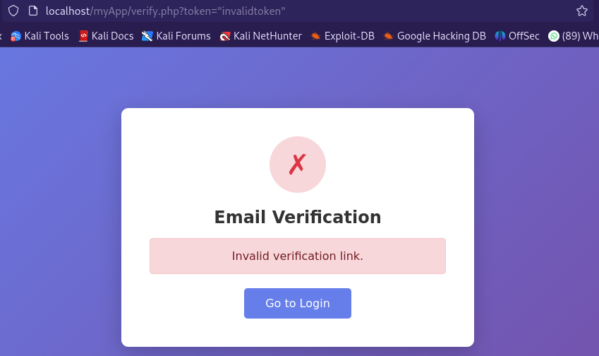
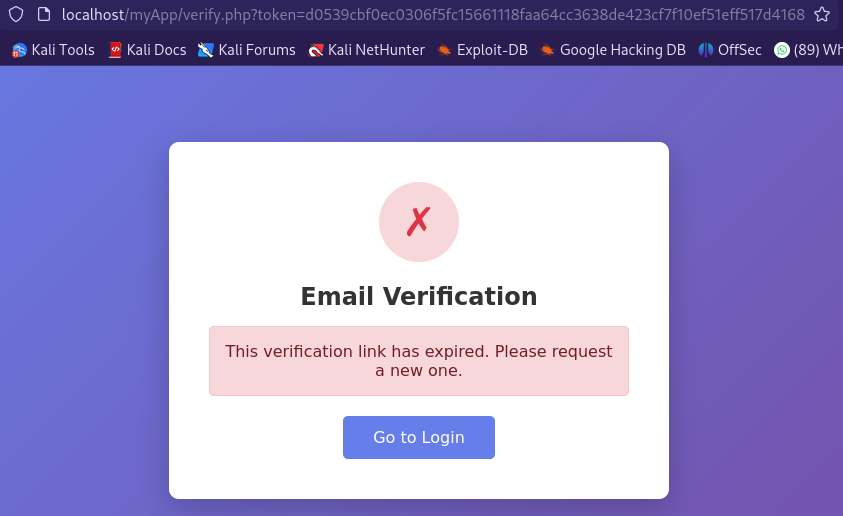
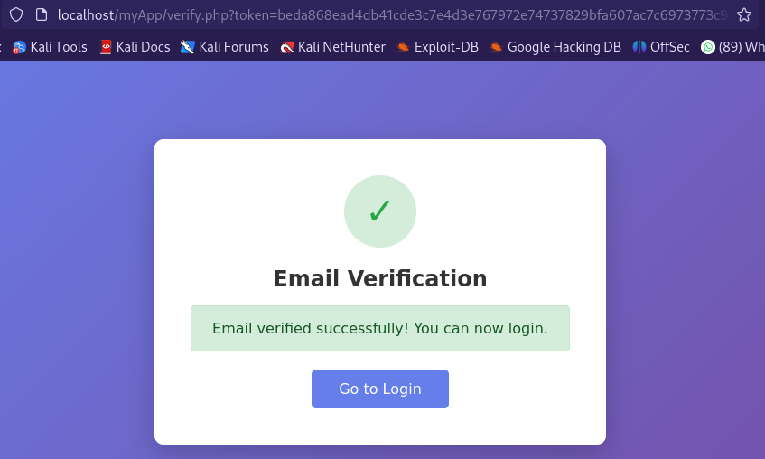

# Day 4 – Real Email Verification with PHPMailer
## 🎯 Goal

On Day 4, I implemented real email delivery for MiniSocialApp using PHPMailer and Gmail SMTP.

## 🛠️ The application can now:

-Send verification emails to newly registered users

-Resend verification emails on user request

-Enforce email verification before allowing login

This was achieved by configuring a dedicated email_config.php file with PHPMailer, a Gmail App Password, and secure SMTP settings. With this update, the authentication flow now mirrors real-world production systems where email ownership must be confirmed before access is granted.

This milestone marks a major step from a local demo system to a production-ready authentication workflow.

## 🖼️ Screenshots (Day 4)
Codespace 
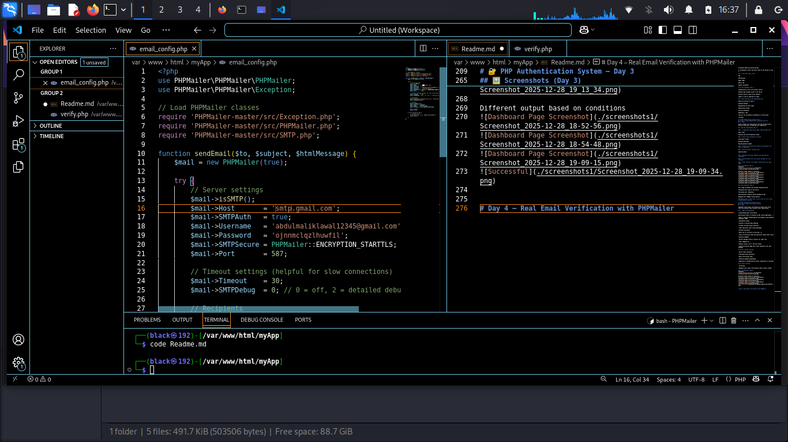

### 👉 For newly registering user
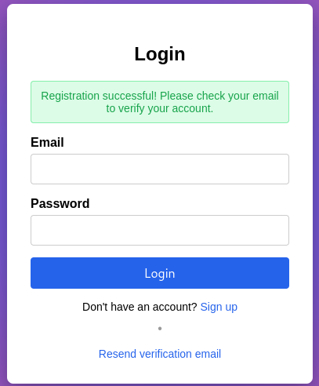
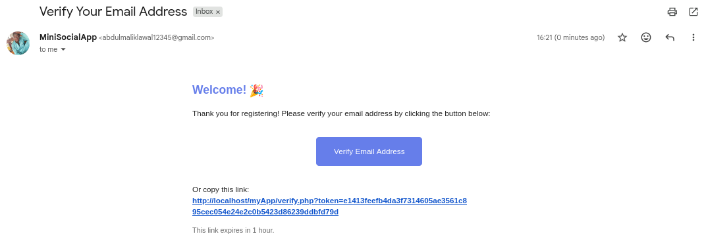

### 👉 For registered but unverified user requesting for email resend
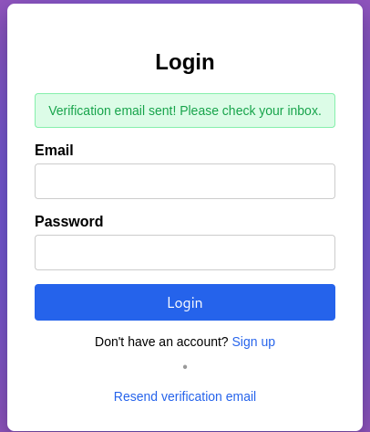
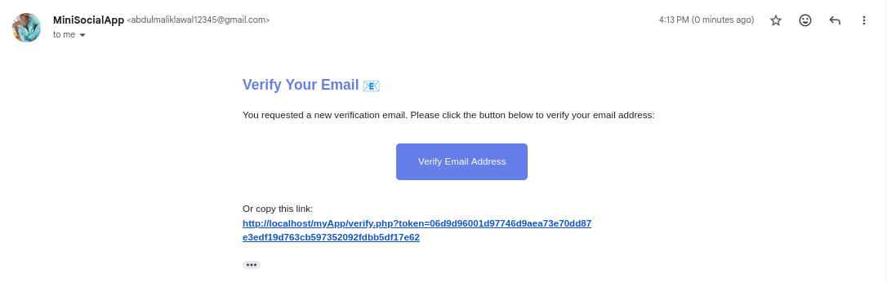

# 📅 Day 5 – Secure Password Reset System (Forgot & Reset Password)

On Day 5, I implemented a complete and secure password recovery workflow for the MiniSocialApp, similar to what is used in real-world platforms like GitHub and LinkedIn.
This feature allows users to safely regain access to their accounts while protecting the system from abuse and information leaks.

## 🔐 Why “Forgot Password” Matters

-Password loss is unavoidable. A secure recovery system must:
-Help legitimate users recover access
-Prevent attackers from exploiting reset flows
-Avoid revealing whether an email exists

This implementation prioritizes security without sacrificing usability.

## 🧩 Feature Overview
### 1️⃣ Forgot Password Request (forgot_passwd.php)

-Users submit their email to request a reset.
Key logic:
-Email format validation
-Silent user lookup (no account disclosure)
-Secure reset token generation
-1-hour token expiration
-Reset link sent via real email (PHPMailer + Gmail SMTP)
-Generic success message for all cases

🔒 Prevents email enumeration attacks.

### 2️⃣ Email-Based Reset Link

Users receive a one-time, time-limited reset link via email.
If they didn’t request it, they can safely ignore it.

### 3️⃣ Token Validation (reset_passwd.php)

On link access:
-Token existence is verified
-Expiration is checked
-Invalid or expired tokens are rejected immediately
-This blocks replay attacks and old-link abuse.

### 4️⃣ Password Reset Rules

Before updating:
-Passwords must match
-Minimum length enforced
-New password cannot equal the old one

This prevents fake resets and encourages better security practices.

### 5️⃣ Secure Password Update

-Password hashed with password_hash()
-Reset token invalidated immediately
-Expiration cleared
-User redirected to login
-Tokens become unusable after a successful reset.

🛡️ Security Practices Applied

-Token-based recovery
-Time-limited reset links
-Strong password hashing
-No account existence disclosure
-One-time token usage
-Old-password reuse prevention

## 🖼️ Screenshots (Day 5)
Codespace 
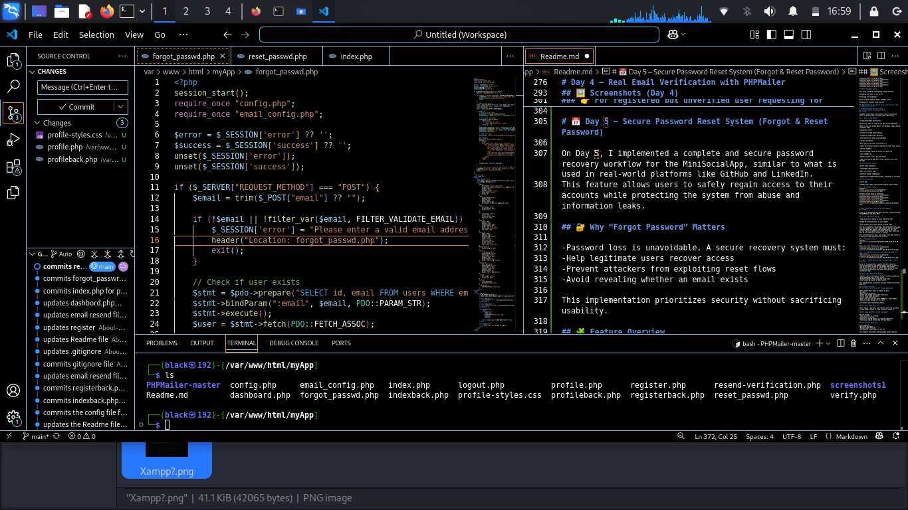

Typical Process When Resetting Password
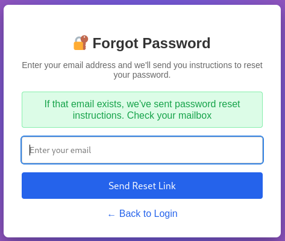
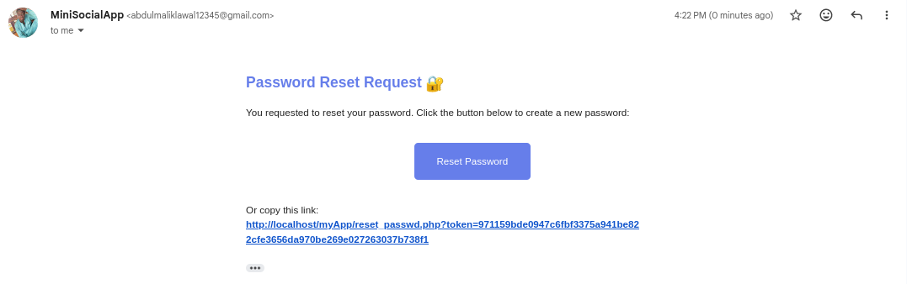
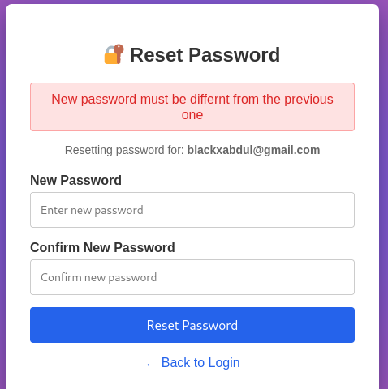
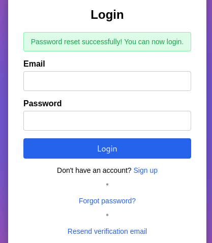

# Day 6 – User Profile Management & Account Control

On Day 6, I implemented a full user profile system that allows authenticated users to manage their account securely and independently.

## What Was Added

### 1. Profile Page (profile.php)

-Restricted access to logged-in users only (session-based authentication).

-Fetches and displays user data directly from the database.

-Clean UI showing:

-Avatar placeholder

-Email

-Account creation date

-Last profile update date

### 2. Profile Actions Backend (profileback.php)
Handled multiple sensitive user actions using a single controller pattern:

-Update Personal Information

--Full name, phone, bio, location, date of birth

--Uses prepared statements to prevent SQL injection

-Change Password

--Verifies current password before update

--Enforces minimum password length

--Uses password hashing for security

-Delete Account

--Permanent account deletion with confirmation

--Session destroyed immediately after deletion

### 3. Profile Styling (profile-style.css)

-Responsive, modern layout using CSS Grid

-Clear separation between profile info, forms, and danger zone

-Mobile-friendly adjustments for smaller screens

## Key Concepts Practiced

-Secure session handling

-Authorization checks

-Form handling with multiple actions

-Password verification & hashing

-Account lifecycle management (update → secure → delete)

-Clean separation of logic, UI, and styles

## 🖼️ Screenshots (Day 6)
Codespace 
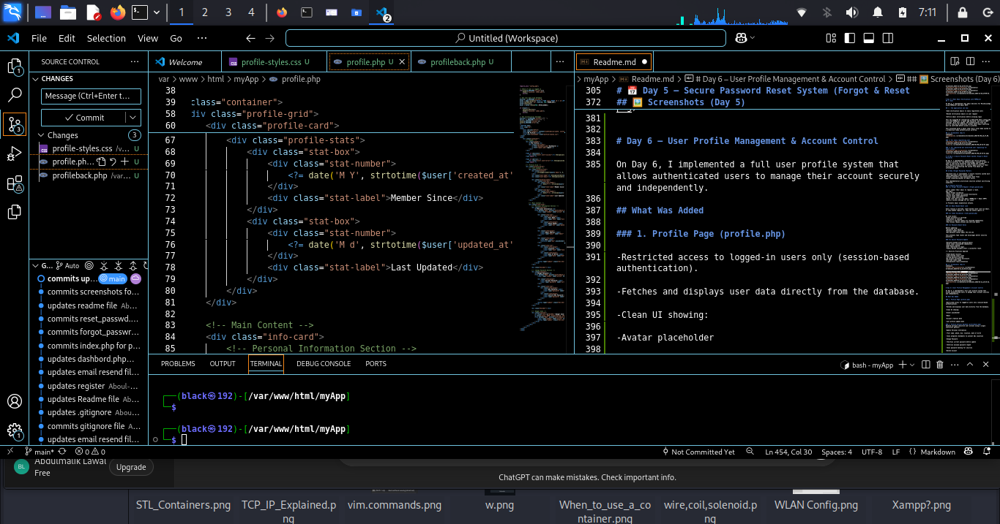

Personal info section
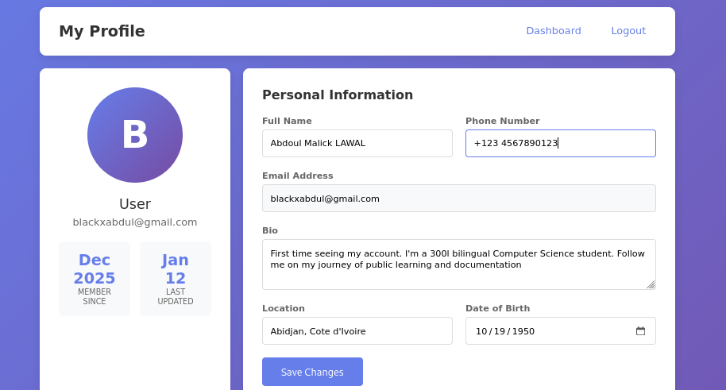

Password section
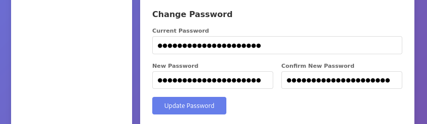

Delete section

Full view
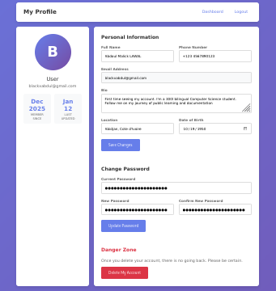

# Day 7 – Selective Dark Mode Integration (Dashboard & Profile)

On Day 7, I introduced a selective Dark Mode system to improve user experience while keeping the app clean and intentional.

## 🎯 Design Decision

Dark mode was added only to authenticated pages:

✅ Dashboard

✅ Profile

The login page intentionally remains light-only to:

-Avoid over-design

-Keep the entry point simple and fast

-Maintain focus on authentication (short, public-facing view)

## 🌗 What Was Implemented

✅ Theme toggle button (Light 🌞 / Dark 🌙) on Dashboard and Profile

✅ CSS variables (:root + [data-theme="dark"]) for scalable theming

✅ Persistent theme state using localStorage

✅ Smooth transitions between themes

✅ Shared theme behavior across Dashboard and Profile

## 🛠 Modified Files

✅ dashboard.php

--Inline CSS with light/dark variables

--Theme toggle logic with localStorage

✅ profile.php

--Theme toggle button + JS logic

--Syncs with Dashboard theme

✅ profile-style.css

--Refactored to use CSS variables

--Added dark-mode color palette

## 🖼️ Screenshots (Day 7)
Unchanged login page 

Dark dashboard page

Light dashboard page

Dark profile page
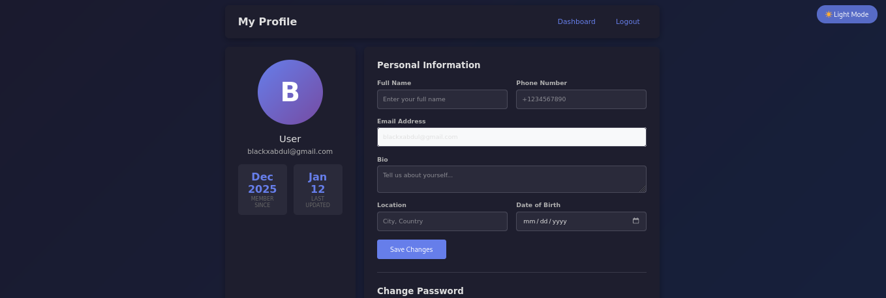

Light profile page
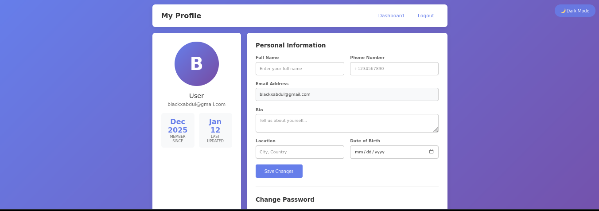

## ✅ Outcome

-Cleaner UX with context-aware theming

-No visual overload on the login page

-Dark mode feels intentional, not cosmetic

-Strong separation between public and authenticated UI

🧩 This step reinforces a core UI principle: not every page needs every feature.

#  Day 8 – Admin System & Role-Based Access Control
## Overview

On Day 8, an Administrator system was introduced to MiniSocialApp. This adds role-based access control, a secure admin dashboard, and protections against unauthorized access to admin-only pages.

## Key Features Implemented
### 👥 User Roles

-Added a role column to the users table (user / admin)

-User role is loaded into the session at login

-Session now stores:

--id_user

--user_email

--full_name

--user_role

### 🔐 Role-Based UI Rendering

Dashboard now conditionally displays the “Admin Panel” button

Only users with role = admin can see and access admin features

### 🛡️ Admin Access Protection

-Created a reusable admin-check.php

-Required in all admin pages

-Prevents:

--Non-logged-in users

--Logged-in but non-admin users

-Redirects unauthorized users back to the dashboard with an error message

### ⚙️ Admin Dashboard

-Centralized admin interface with:

--User statistics (total, verified, unverified, admins)

--Full users table

-Admin actions:

--Delete users (cannot delete self)

--Promote/Demote users (admin ↔ user)

--All actions handled securely via POST requests

### 🎨 Styling & UX

-Dedicated admin dashboard styles

-Consistent layout with the rest of the app

-Integrated Dark Mode support

-Clear badges for:

--User roles

--Verification status

## 🖼️ Screenshots (Day 8)
 

 
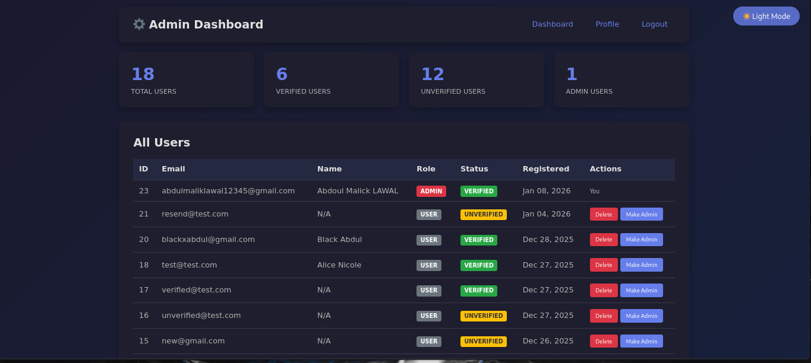

 
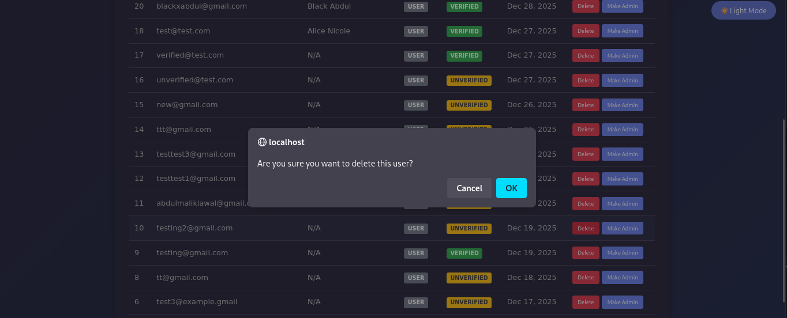

 
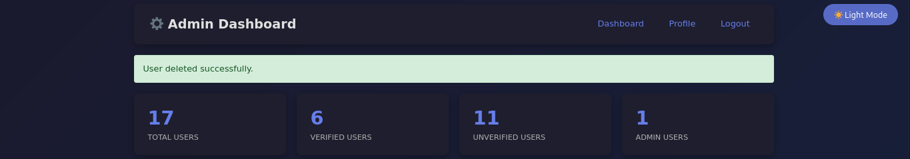

 
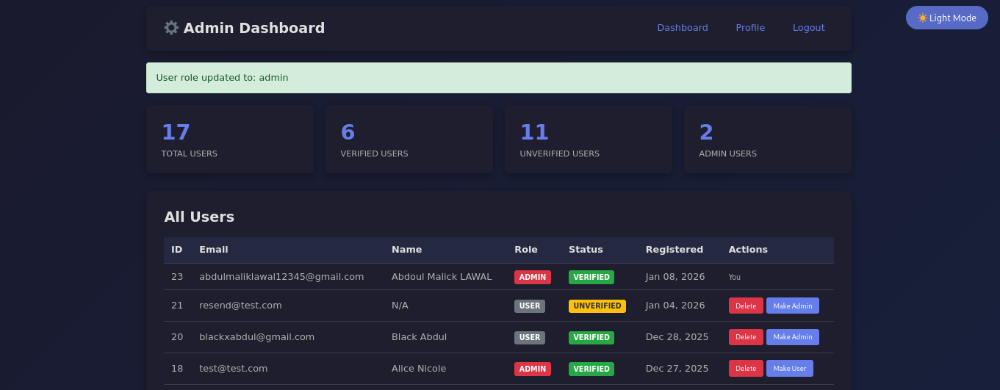

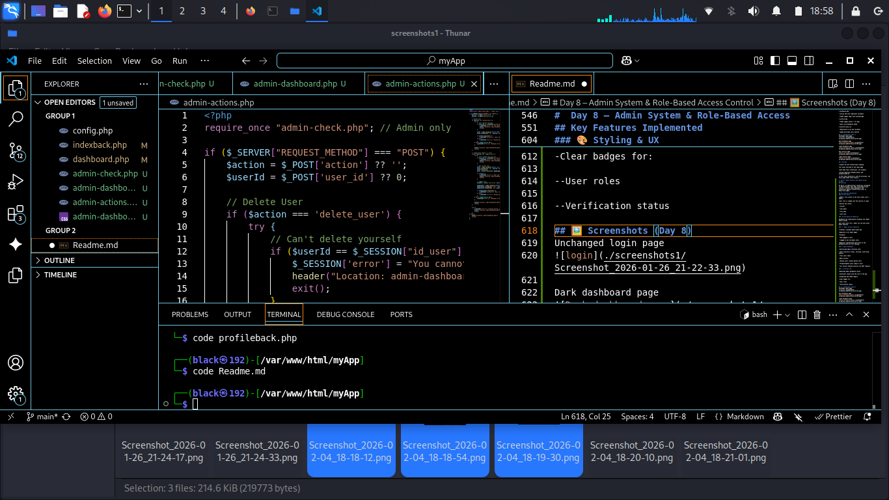

## Why This Matters

This milestone transforms MiniSocialApp from a basic authentication app into a multi-role system, laying the foundation for:

Moderation tools

Scalable permissions

Real-world application architecture

#  Day 9 – API Foundation & JWT Authentication

On Day 9, I started expanding MiniSocialApp beyond server-rendered pages by introducing a dedicated REST API layer.
A new /api directory was created to host endpoints for authentication and user management, preparing the project for future integrations with mobile apps, SPAs, or other services.

## Key Implementations
### API Structure

Created a new /api directory to organize backend endpoints. Planned APIs include:

login
registration
user
users
change-password

This separates API logic from the traditional PHP pages, making the architecture more scalable.

### JWT Authentication System

Implemented a custom JWT (JSON Web Token) authentication mechanism.

Features include:

Token generation with HS256 signing

Payload containing:

user_id

email

role

iat (issued at)

exp (expiration – 24h)

Token verification with signature validation

Token extraction from Authorization Bearer headers

Utility middleware functions:

requireAuth() – protects endpoints requiring authentication

requireAdmin() – restricts admin-only API routes

### API Configuration Layer

Created /api/config.php to standardize API behavior:

Loads environment variables

Reuses the parent database configuration

Handles CORS headers

Processes OPTIONS preflight requests

Provides helper functions:

sendResponse()

getRequestBody()

### Environment Management

Improved security and configuration handling by introducing:

.env file for environment variables

Custom environment loader

Generated and stored JWT_SECRET securely

This ensures sensitive data like secrets and credentials stay outside the codebase.

### Server Configuration

Added .htaccess to support API routing and improve request handling.

##  Screenshots (Day 9)
 
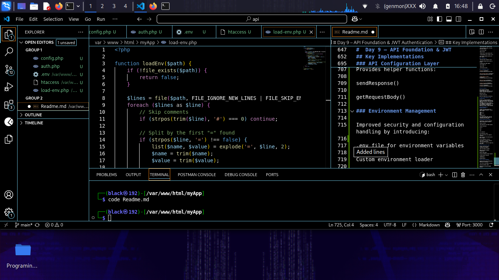

# Day 10 – API Authentication Endpoints (Register & Login)

## Overview

On Day 10, I moved from building the API foundation to implementing and testing the first working authentication endpoints:
➡️ /api/register
➡️ /api/login

Both endpoints were fully tested using Postman, with well-structured request bodies and clean JSON responses.

## Register Endpoint (/api/register)

Handles new user creation with proper validation and security.

Key Features:
    Validates email format and password length
    Prevents duplicate registrations (409 Conflict)
    Hashes passwords using password_hash()
    Generates email verification token with expiration
    Stores user with default role (user) and unverified status
Response:
    201 Created on success
Returns:
    success message
    user_id
    verification_required flag

## Login Endpoint (/api/login)

Authenticates users and issues a JWT token.

Key Features:
    Validates request method and input fields
    Verifies credentials using password_verify()
    Blocks login if email is not verified (403)
    Generates JWT token with user data (id, email, role)
Response:
    200 OK on success
Returns:
    success message
    JWT token
    authenticated user details

## API Testing (Postman)
Structured raw JSON requests
Verified status codes:
    400 → Bad request
    401 → Invalid credentials
    403 → Not verified
    409 → Conflict
    201 / 200 → Success
Confirmed consistent and predictable API responses

## Key Takeaways
Transitioned from theory (Day 9) to real working API endpoints
Understood proper use of HTTP status codes
Built secure authentication flow with validation + hashing + JWT
Practiced real-world API testing workflows

##  Screenshots (Day 10)

### /api/register 
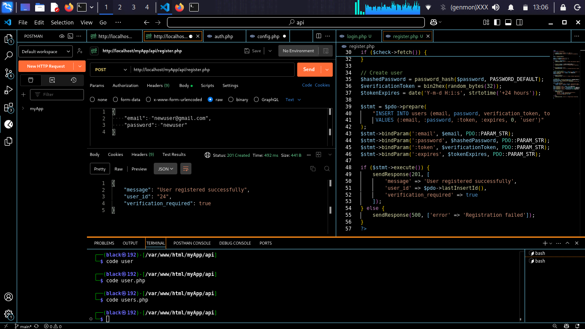
### /api/login
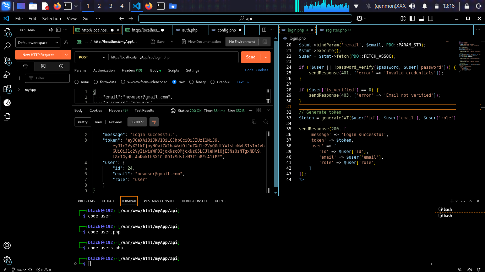

# Day 11 – User Management APIs & Role-Based Access Control

## Overview

On Day 11, I expanded the MiniSocialApp API by implementing a full set of user management endpoints, with strong emphasis on authorization, security, and proper access control.

This stage moves the API closer to a real-world backend system, where different users have different permissions and capabilities.

## Role-Based Access Control (RBAC)

All endpoints are protected using JWT authentication and role checks:

Admin-only routes for sensitive operations
User-restricted actions to ensure users can only act on their own data
Clear separation between admin privileges and regular user capabilities

## Implemented Endpoints
### GET /api/users (Admin Only)

Retrieve all users in the system.

Features:

Protected with requireAdmin()
Returns total user count and user list
Ordered by latest registrations

### GET /api/user?id={id}

Retrieve a single user’s data.

Access Control:

Users can fetch their own profile only
Admins can fetch any user

Response:

Full user profile including metadata (email, bio, role, timestamps)

### PUT /api/user?id={id}

Update user profile information.

Features:

Users can update their own data only
Admins can update any user
Supports fields like name, phone, bio, and location
Updates updated_at timestamp automatically

### DELETE /api/user?id={id} (Admin Only)

Delete a user from the system.

Features:

Restricted to admins via requireAdmin()
Prevents unauthorized deletions
Clean success/error responses

### PUT /api/change-password

Allow authenticated users to securely change their password.

Security Measures:

Requires current password verification
Enforces password confirmation match
Validates minimum password length
Uses password_hash() for secure storage
Updates timestamp on success

## API Testing (Postman)

All endpoints were thoroughly tested using Postman:

Verified role-based restrictions (user vs admin)
Tested all HTTP methods: GET, PUT, DELETE
Validated responses for:
200 → Success
400 → Bad request
401 → Unauthorized
403 → Forbidden
404 → Not found
500 → Server errors

##  Screenshots (Day 11)

### GET api/users (admin GETting all users)
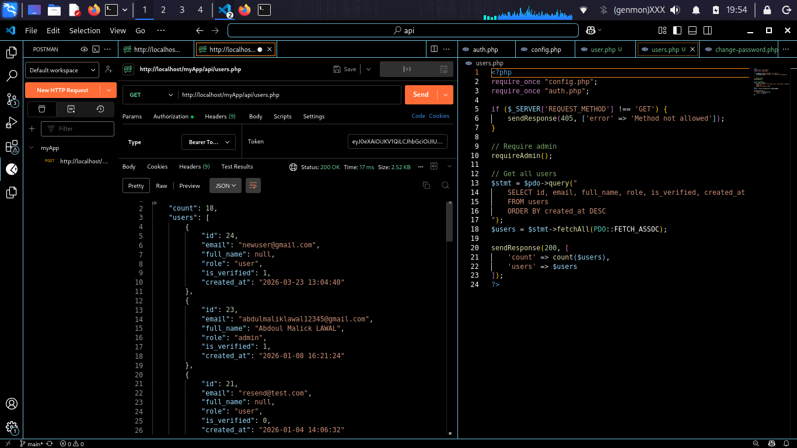

### GET api/user (GETing by user before modifying user profile)
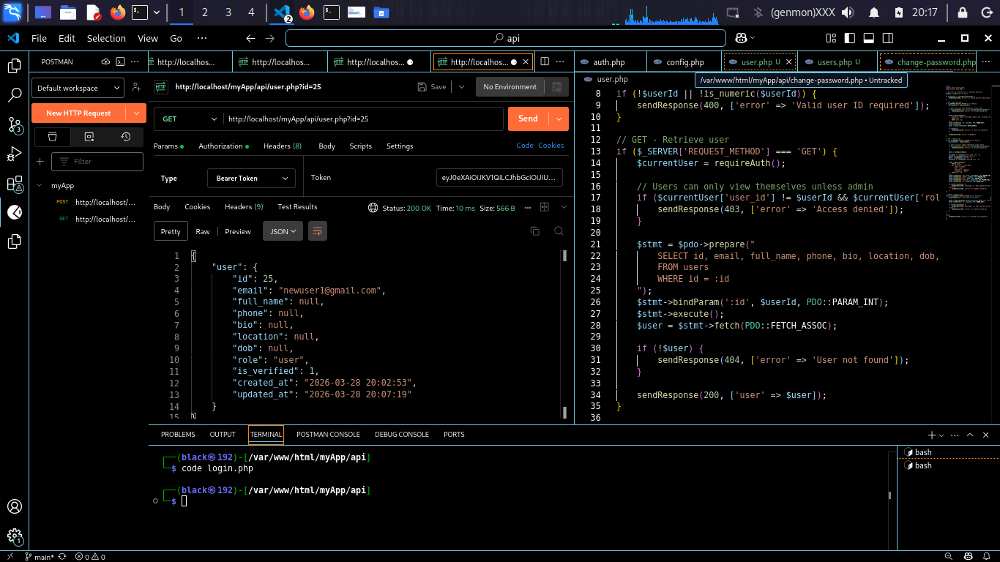

### PUT api/user (user modifying his profile)
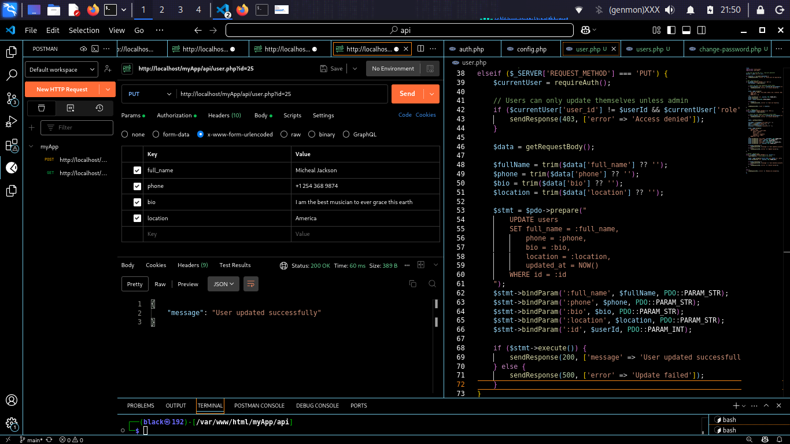

### GET api/user (GETing by user after modifying user profile)
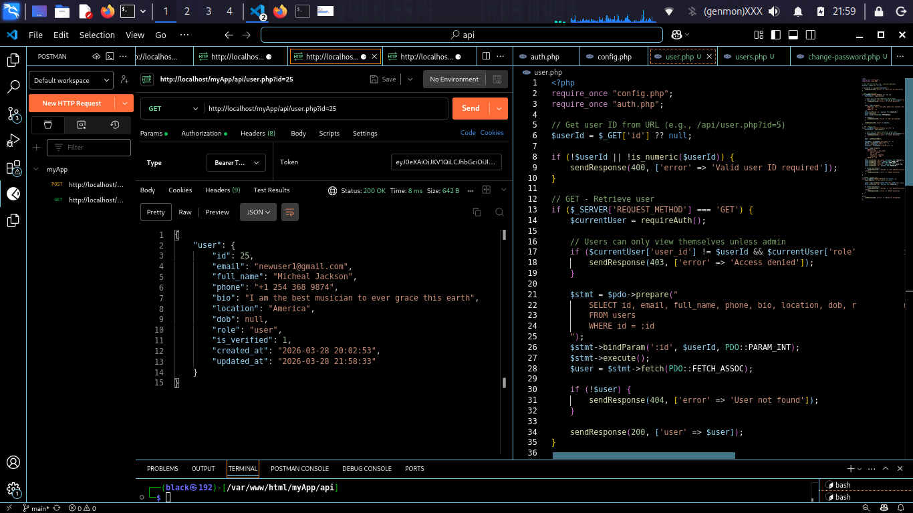

### GET api/change-password (user changing his password)
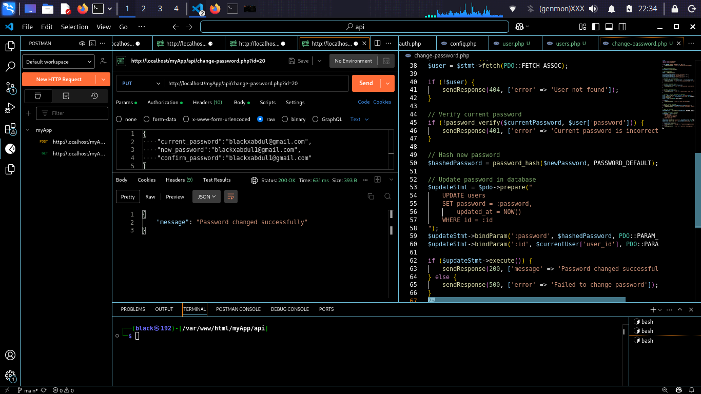

### DELETE api/user (user trying to delete himself)
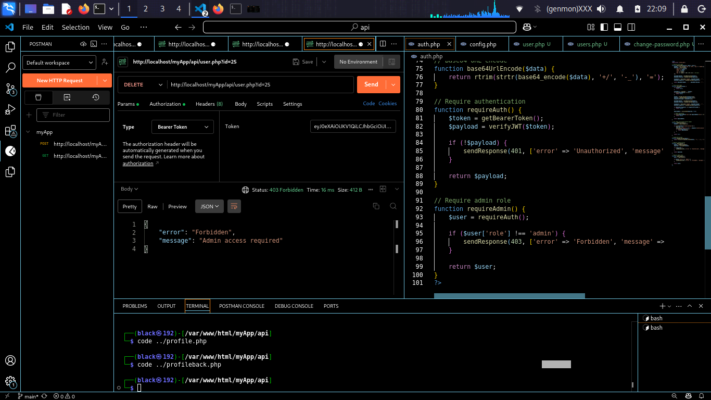

### DELETE api/user (admin successfully deleting user)
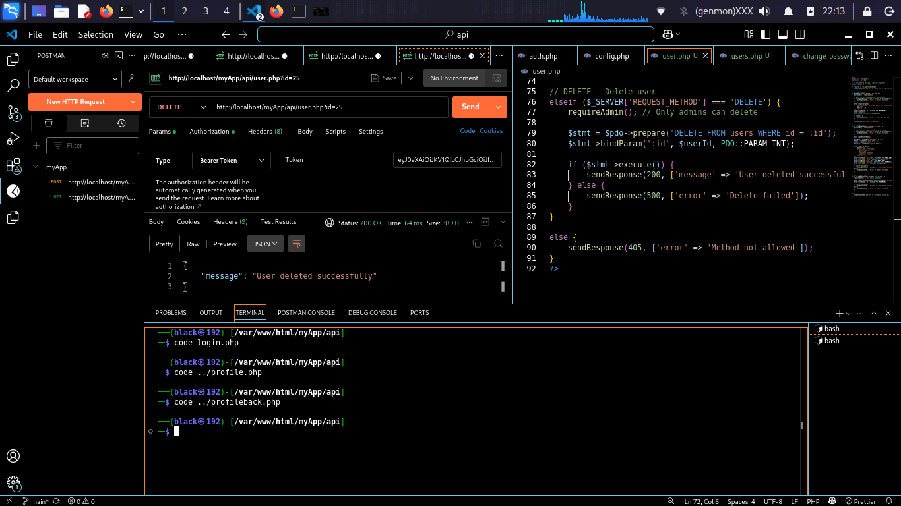

### GET api/user (trying to GET deleted user)
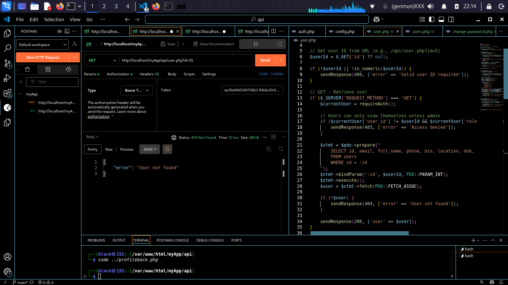

# Day 12 – Email Verification & Password Reset APIs

## Overview

On Day 12, I completed the remaining authentication flow endpoints, mirroring what the session layer already had in verify.php, resend-verification.php, forgot_passwd.php and reset_passwd.php — but now exposed as a clean REST API.

➡️ /api/verify-email
➡️ /api/resend-verification
➡️ /api/forgot-password
➡️ /api/reset-password

## Endpoints

### /api/verify-email
Activates a user account using the token sent during registration.

Key Features:
    Accepts token via POST body
    Validates token existence, expiry, and already-verified state
    Clears token fields after successful verification
Response:
    200 → Email verified successfully
    400 → Invalid token
    409 → Already verified
    410 → Token expired

### /api/resend-verification
Issues a fresh verification token and resends the email.

Key Features:
    Rejects already-verified accounts (409)
    Generates new token with 24h expiry
    Sends email via PHPMailer + Gmail SMTP
    Returns 200 even if email not found (prevents account enumeration)
Response:
    200 → Email sent (or silently skipped if not found)
    409 → Already verified

### /api/forgot-password
Initiates password recovery by emailing a one-time reset link.

Key Features:
    Silent user lookup — never reveals whether email is registered
    Generates reset token with 1h expiry
    Sends reset link via PHPMailer
    Uses APP_URL from .env for the reset link base
Response:
    200 → Generic success in all cases (security)
    400 → Invalid email format

### /api/reset-password
Completes the password reset using the token from the email.

Key Features:
    Validates token existence and expiry
    Enforces password confirmation match and minimum length
    Prevents reuse of the current password
    Clears reset token after successful update
Response:
    200 → Password reset successfully
    400 → Validation errors / same password reuse
    410 → Token expired

## API Testing (Postman)
Tested full flow end to end:
    Registered user → received verification email → verified via token
    Attempted login before verification → blocked (403)
    Requested password reset → received email → reset with new password
    Attempted reuse of reset token → rejected (410)
Verified status codes:
    200 → Success
    400 → Bad request / validation failure
    403 → Not verified
    409 → Conflict
    410 → Expired token

## Key Takeaways
Understood why generic responses protect against account enumeration attacks
Learned the difference between token expiry (410) and invalid token (400)
Saw how the API layer mirrors session-based logic with cleaner separation of concerns
Completed the full authentication lifecycle across both layers of the app

## Screenshots (Day 12)

### /api/resend-verification
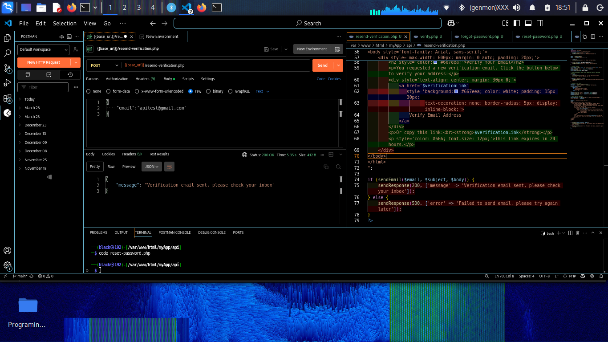
### /api/verify-email
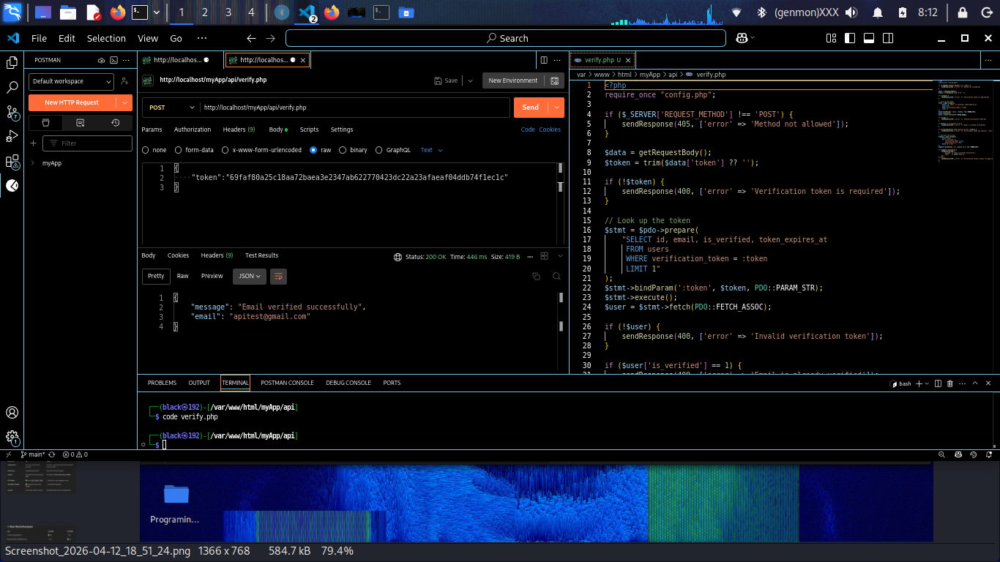
### /api/forgot-password
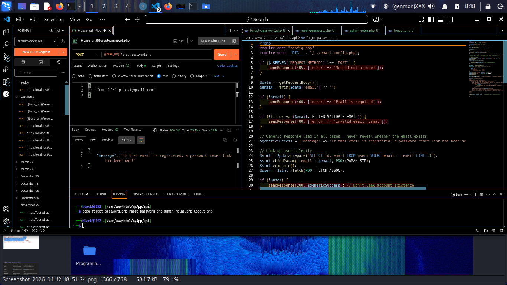
### /api/reset-password
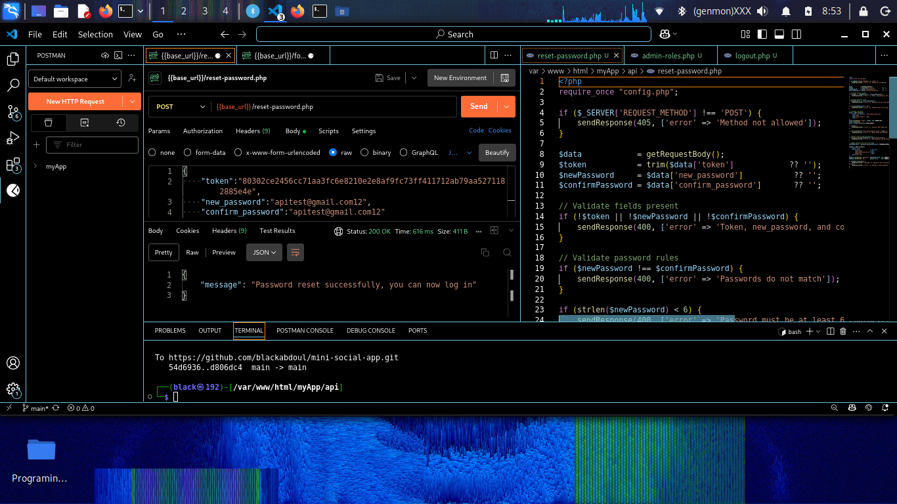

# Day 13 – Bug Fixes, JWT Logout & Admin Role Toggle API

## Overview

On Day 13, I focused on hardening the existing API layer — fixing a scoping bug that broke authenticated endpoints, completing the logout system with real token invalidation, and finalizing the admin role toggle endpoint.

➡️ /api/logout
➡️ /api/admin-roles

## What Was Fixed & Implemented

### 🐛 PHP Scoping Bug (auth.php)

After adding the token blacklist check to requireAuth(), all authenticated endpoints started returning 500.

Root cause:
$pdo is created in global scope but PHP functions cannot see global variables unless explicitly declared inside them

Fix:
Added global $pdo; as the first line inside requireAuth() so the blacklist query has access to the database connection

### 🔒 JWT Logout (/api/logout)

Implemented real server-side logout by blacklisting the token.

Key Features:
    Requires valid JWT (authenticated endpoint)
    Extracts raw token from Authorization header
    Inserts token into token_blacklist table with its expiry timestamp
    requireAuth() now rejects any blacklisted token on future requests
    Token becomes unusable immediately after logout even if not yet expired
Response:
    200 → Logged out successfully
    500 → Logout failed

### 👥 Admin Role Toggle (/api/admin-roles)

Allows admins to promote or demote other users.

Key Features:
    Admin-only endpoint via requireAdmin()
    Accepts user_id in request body
    Fetches current role and toggles it (user → admin, admin → user)
    Admins cannot change their own role (403)
    Returns previous and new role in response for confirmation
Response:
    200 → Role updated successfully with previous_role and new_role
    400 → user_id missing
    403 → Attempting to change own role
    404 → User not found

### 🛠️ user.php Improvements

Fixed PUT endpoint to include dob (date of birth) field which was present in the session layer but missing from the API

Fixed DELETE endpoint to allow users to delete their own account, not just admins

## API Testing (Postman)
Confirmed logout blacklists token correctly
Verified blacklisted token returns 401 on subsequent requests
Tested role toggle: user → admin on first hit, admin → user on second hit
Confirmed admins cannot toggle their own role (403)
Validated dob saves correctly via PUT /api/user

## Key Takeaways
PHP functions are isolated from global scope — always declare global $pdo inside functions that need it
JWT logout requires server-side blacklisting — discarding the token client-side alone is not enough
A toggle endpoint is cleaner than separate promote/demote endpoints when the logic is symmetric

## 🖼️ Screenshots (Day 13)

### PUT /api/admin-roles (user → admin)
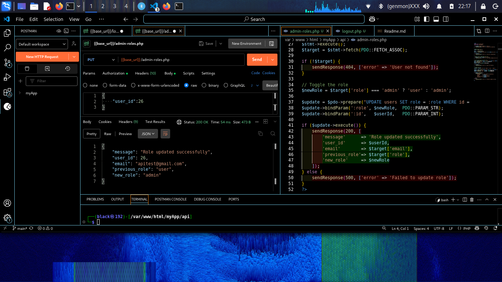

### PUT /api/admin-roles (admin → user)
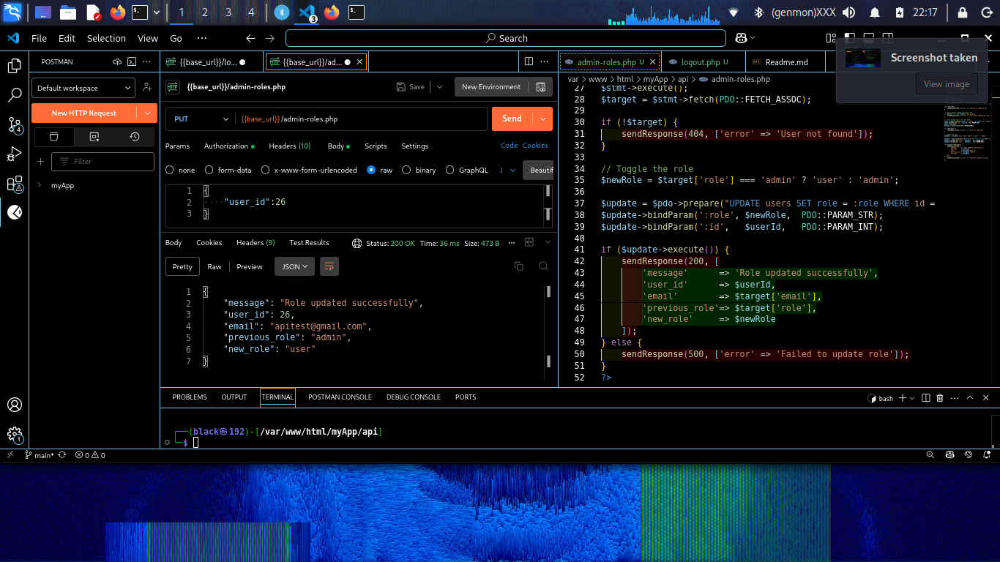

### POST /api/logout
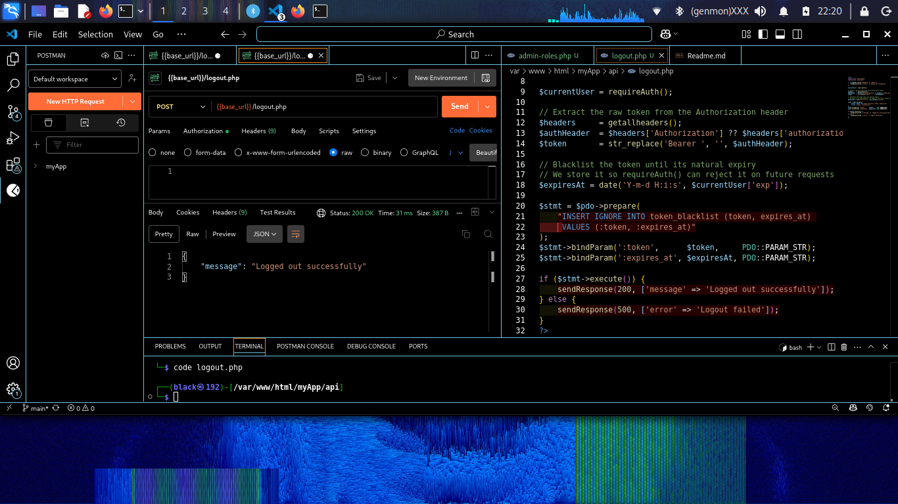

Looking at the screenshots — feed working with images and text posts, create tab, me tab all confirmed. Here's the caption:

# Day 14 – Posts & Dashboard Redesign (Session Layer)

## Overview

On Day 14, I introduced the core social feature of MiniSocialApp — posts.
This involved redesigning the dashboard from scratch and building the full
create/delete post flow with image upload support on the session layer.

➡️ dashboard.php (redesigned)
➡️ postback.php (new)
➡️ uploads/posts/ (new)
➡️ posts table (new)

## Database

### posts table
New table created to store all posts:

    id          → auto-increment primary key
    user_id     → foreign key referencing users(id), CASCADE on delete
    content     → post text body (nullable — image-only posts allowed)
    image_path  → relative path to uploaded image (nullable)
    created_at  → auto-set on insert
    updated_at  → auto-updates on row change

Foreign key constraint ensures no orphan posts exist if a user is deleted.
Indexes on user_id and created_at keep feed queries fast.

## Dashboard Redesign (dashboard.php)

Replaced the old card-based dashboard with a sticky navbar + tab layout.

### Navbar
    MiniSocial brand on the left
    Theme toggle (light/dark, persisted via localStorage)
    Admin panel shortcut (only visible to admins)
    Avatar circle linking to profile (shows first letter of name)

### Tabs
Three tabs with no page reload — pure JS switching:

    Feed      → public post feed, newest first
    New Post  → compose UI with image upload
    Me        → quick profile summary with links

### Feed Tab
    Fetches all posts via JOIN with users table to get author info
    Posts display author avatar (initial letter), name, timestamp, content, image
    Delete button visible only to post owner or admin
    Staggered fade-up animation on post cards
    Empty state shown when no posts exist

### New Post Tab
    Compose card with textarea (1000 char limit + live counter)
    Image upload button (JPG, PNG, GIF, WEBP — max 5MB)
    Shows selected filename after picking an image
    After successful post, auto-switches back to Feed tab

### Me Tab
    Shows logged-in user's avatar, full name, email
    Links to Edit Profile and Log out

## Post Handler (postback.php)

Single controller handling two actions via hidden form field.

### create_post
    Validates at least content or image is present
    Enforces 1000 character limit
    Validates image MIME type by reading file bytes (not just extension)
    Enforces 5MB size limit
    Generates unique filename with uniqid() to prevent collisions
    Moves file to uploads/posts/ via move_uploaded_file()
    Stores relative image path in DB
    Uses Post/Redirect/Get pattern to prevent form resubmission

### delete_post
    Fetches post from DB before deleting to verify ownership
    Server-side check — owner or admin only
    Deletes DB row then removes image file from server with unlink()
    Prevents orphan files accumulating in uploads/posts/

## Bug Fixed Along The Way
    Foreign key error on posts table creation — caused by INT vs INT UNSIGNED
    mismatch between users.id and posts.user_id. Fixed by matching types.
    Image upload failing with 500 — uploads/posts/ was owned by black instead
    of www-data. Fixed with: sudo chown -R www-data:www-data uploads/

## Key Takeaways
    JOIN queries let you pull related data without duplicating it across tables
    MIME type validation is safer than extension checking for file uploads
    Post/Redirect/Get prevents duplicate submissions on browser refresh
    File cleanup on delete is just as important as the delete query itself
    PHP functions don't see global variables — always declare global $pdo inside functions

## 🖼️ Screenshots (Day 14)

### Admin's feed
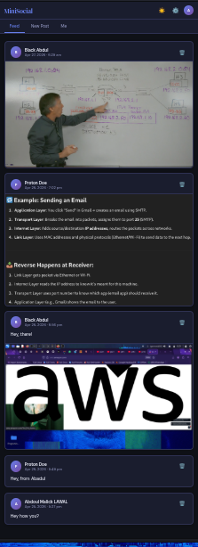

### User's feed (success message)
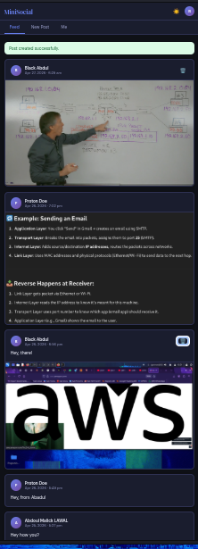

### New Post tab
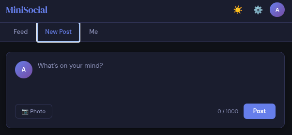

### Me tab
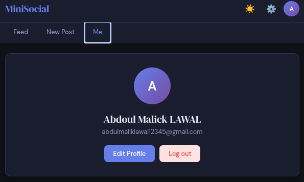

# Day 15 – Posts API (GET, POST, DELETE)

## Overview

On Day 15, I built the API layer for posts — mirroring what the session
layer already does in postback.php but now exposed as REST endpoints.

➡️ /api/posts.php
➡️ /api/post.php

## Endpoints

### GET /api/posts.php — fetch all posts (public)

Returns all posts newest first, joined with author info.

Key Features:
    No authentication required — publicly accessible
    Pagination via query params: ?limit=20&offset=0
    Limit capped at 100 to prevent abuse
    Returns total count alongside posts for frontend pagination
Response:
    200 → { total, limit, offset, posts[] }
    405 → Method not allowed

### GET /api/post.php?id=X — fetch single post (public)

Returns a single post by ID with full author info.

Key Features:
    No authentication required
    Validates id is numeric
Response:
    200 → { post: { id, content, image_path, created_at, updated_at, user_id, author_name, author_email } }
    400 → Valid post ID required
    404 → Post not found

### POST /api/post.php — create post (JWT required)

Creates a new post with optional image upload.

Key Features:
    Requires valid JWT token
    Body must be form-data (not raw JSON) to support file upload
    Validates at least content or image is present
    Enforces 1000 character content limit
    Validates image MIME type by reading file bytes
    Enforces 5MB image size limit
    Generates unique filename with uniqid() to prevent collisions
    Stores relative image path in DB
Response:
    201 → Post created successfully + post_id
    400 → Validation errors
    401 → Unauthorized
    500 → Upload or insert failure

### DELETE /api/post.php?id=X — delete post (JWT required)

Deletes a post by ID. Owner or admin only.

Key Features:
    Fetches post before deleting to verify ownership
    Owner can delete their own posts
    Admin can delete any post
    Deletes image file from server with unlink() after DB row removal
Response:
    200 → Post deleted successfully
    400 → Valid post ID required
    403 → No permission
    404 → Post not found
    500 → Delete failure

## API Testing (Postman)
Tested full flow:
    GET /api/posts.php → all posts returned with total, limit, offset metadata
    GET /api/posts.php?limit=3&offset=1 → pagination working correctly
    GET /api/post.php?id=5 → single post with author info returned
    POST /api/post.php → created post with image using form-data + user JWT (201)
    DELETE /api/post.php?id=4 → deleted post using admin JWT (200)
Verified authorization rules:
    POST without token → 401
    DELETE on post you don't own (non-admin) → 403
    DELETE on non-existent post → 404

## Key Takeaways
POST /api/post.php must use form-data not raw JSON — PHP's $_FILES only
works with multipart/form-data. Sending JSON loses the file entirely.
Pagination metadata (total, limit, offset) should always be returned
alongside the data so any client can calculate pages without extra requests.
Image cleanup on delete applies to the API layer too — unlink() must
reference the correct path relative to the API file's location using __DIR__

## 🖼️ Screenshots (Day 15)

### GET /api/posts.php — all posts
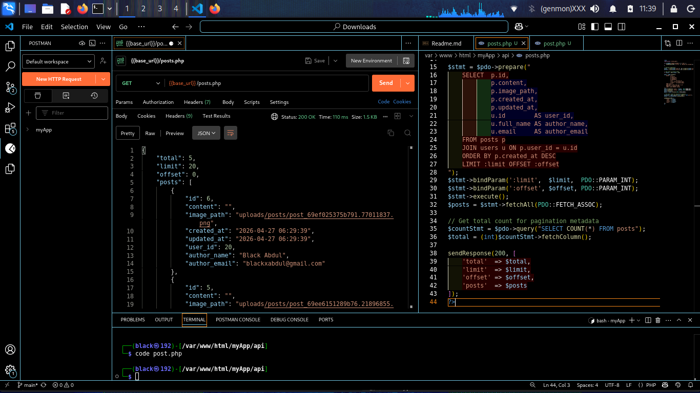

### GET /api/posts.php?limit=3&offset=1 — pagination
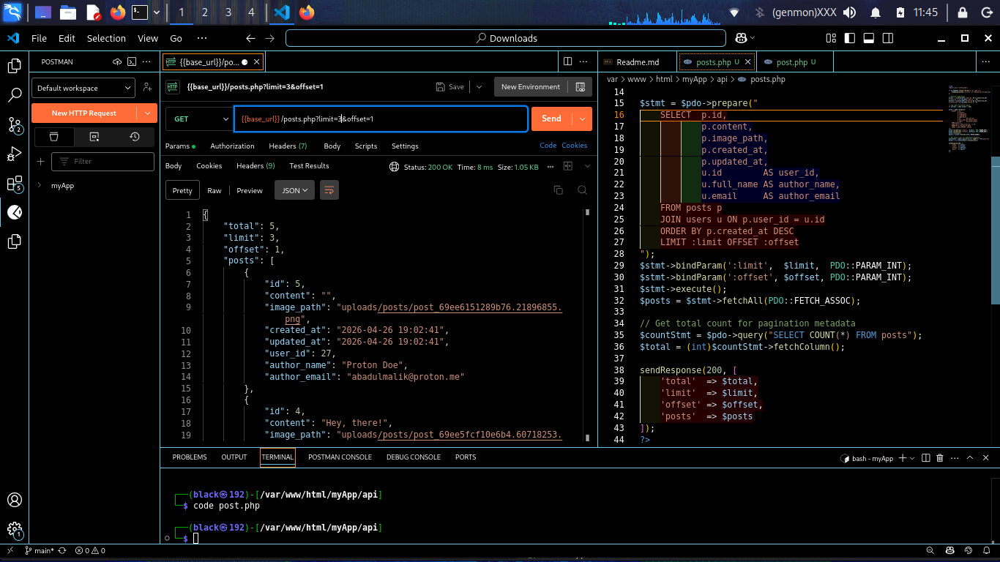

### GET /api/post.php?id=5 — single post
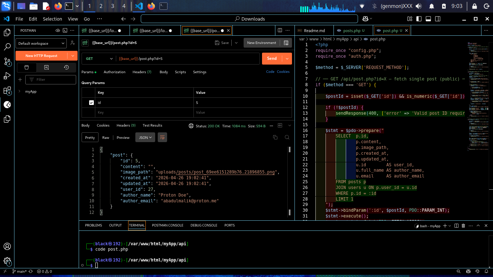

### POST /api/post.php — create post with image (user token)
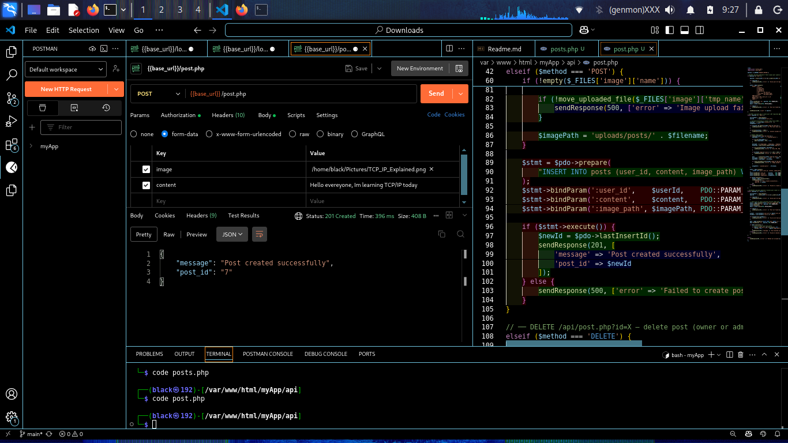

### DELETE /api/post.php?id=4 — delete post (admin token)
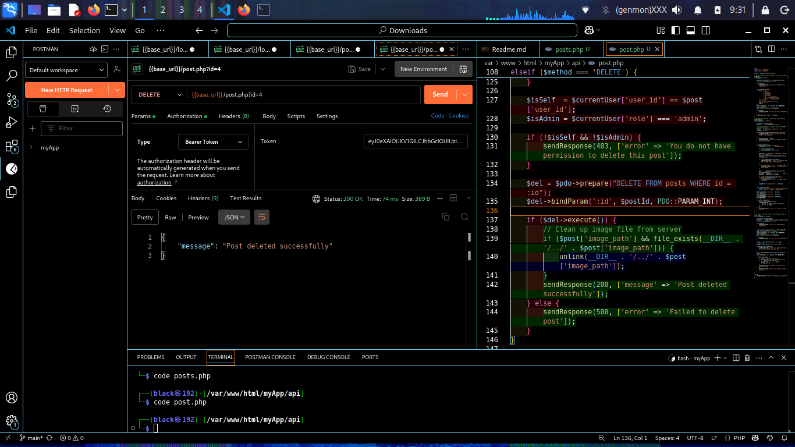

# Day 16 – Likes (Session + API + Optimistic UI)

## Overview

On Day 16, I implemented the full likes feature across both layers
simultaneously — session layer, API layer, and a no-refresh optimistic
UI update so liking feels instant like a real social app.

➡️ likeback.php (new)
➡️ dashboard.php (updated)
➡️ /api/like.php (new)

## Database

### likes table
    id         → auto-increment primary key
    user_id    → FK referencing users(id), CASCADE on delete
    post_id    → FK referencing posts(id), CASCADE on delete
    created_at → auto-set on insert
    UNIQUE KEY (user_id, post_id) → makes double-liking structurally
    impossible at the DB level, not just at the PHP level

The UNIQUE KEY is what enables INSERT IGNORE toggle logic and guarantees
data integrity even if there's a bug in application code.

## Session Layer

### likeback.php
Single toggle handler — no separate like/unlike endpoints needed.

Key Logic:
    Session guard + POST-only check
    Casts post_id to int immediately (rejects non-numeric input)
    Verifies post exists before touching likes table
    Checks if like row exists for this user + post combination
    If yes → DELETE (unlike)
    If no  → INSERT (like)
    Redirects back to dashboard (Post/Redirect/Get pattern)

### dashboard.php (query update)
The posts query was extended to include like data in the same
JOIN — no extra query per post:

    LEFT JOIN likes l ON l.post_id = p.id
    COUNT(l.id) AS like_count
    MAX(CASE WHEN l.user_id = :me THEN 1 ELSE 0 END) AS liked_by_me

LEFT JOIN ensures posts with zero likes are still returned.
MAX(CASE WHEN...) collapses all like rows per post into a single
1 or 0 indicating whether the current user has liked it.
GROUP BY required because of the COUNT and MAX aggregates.

### Optimistic UI (no page refresh)
Replaced the like <form> with a plain <button> using data attributes.
JavaScript intercepts the click, updates the UI instantly, then sends
fetch() in the background.

    data-post-id  → which post
    data-liked    → current state (1 or 0)
    data-count    → current like count

toggleLike() flow:
    1. Reads current state from data attributes
    2. Immediately flips UI (heart fills, count updates) — optimistic
    3. Sends POST to likeback.php via fetch()
    4. On network/server error → rolls back to original state

applyLikeState() handles all DOM updates in one place:
updates data attributes, CSS class, count span, word span,
and re-renders the Lucide heart so fill updates correctly.

## API Layer (/api/like.php)

### GET /api/like.php?post_id=X
Returns like status for the authenticated user on a specific post.

    200 → { post_id, like_count, liked_by_me }
    400 → Valid post_id required
    404 → Post not found

### POST /api/like.php?post_id=X
Toggles like on/off. Returns updated state after toggle.

    200 → { action, post_id, like_count, liked_by_me }
    action is either "liked" or "unliked"
    like_count reflects the new count after the toggle
    liked_by_me is derived from action === 'liked'
    400 → Valid post_id required
    404 → Post not found

## API Testing (Postman)
    GET /api/like.php?post_id=7 → returned like_count: 2, liked_by_me: false
    POST /api/like.php?post_id=7 → action: "liked", like_count: 3, liked_by_me: true
    POST /api/like.php?post_id=7 again → action: "unliked", like_count: 2, liked_by_me: false

## Key Takeaways
    UNIQUE KEY on (user_id, post_id) enforces like integrity at DB level
    Aggregating like data in the main posts JOIN avoids N+1 queries
    Optimistic UI makes interactions feel instant — roll back only on error
    fetch() can call a redirect-based PHP handler without caring about
    the response body — the redirect just gets followed silently

## 🖼️ Screenshots (Day 16)

### Feed — unliked state (user 1)
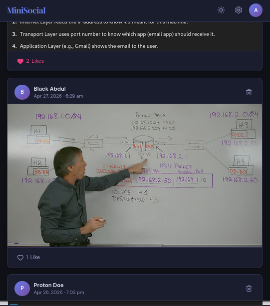

### Feed — liked state (user 2, no refresh)
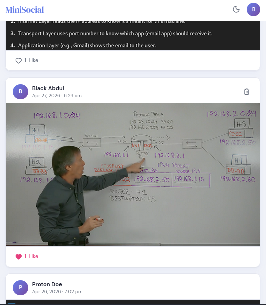

### GET /api/like.php?post_id=7
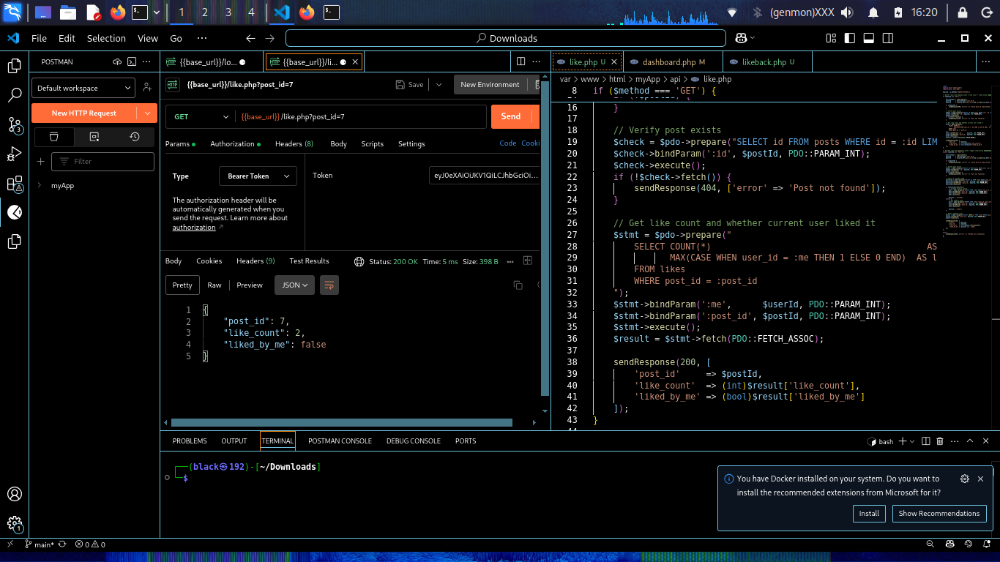

### POST /api/like.php?post_id=7 — liked
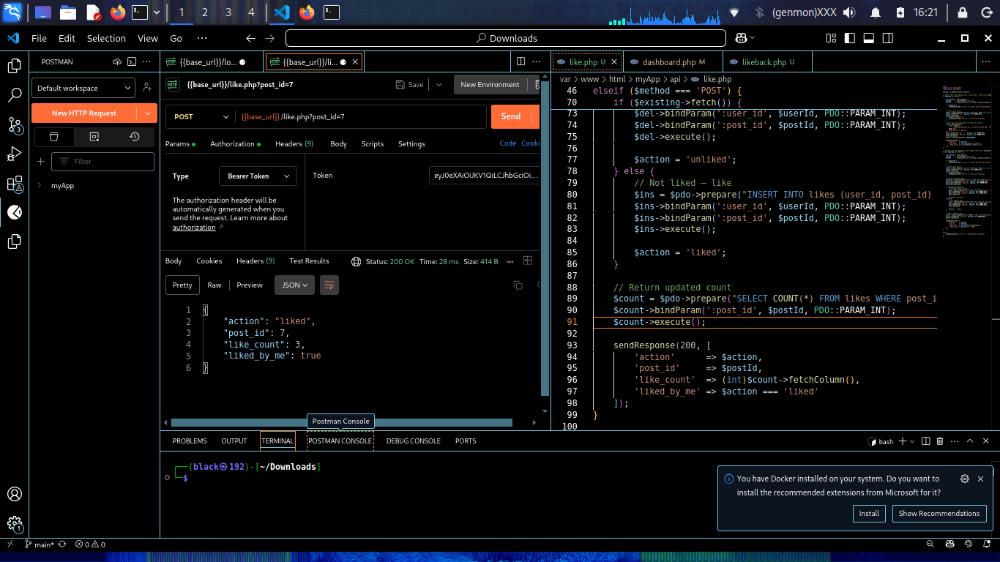

### POST /api/like.php?post_id=7 — unliked
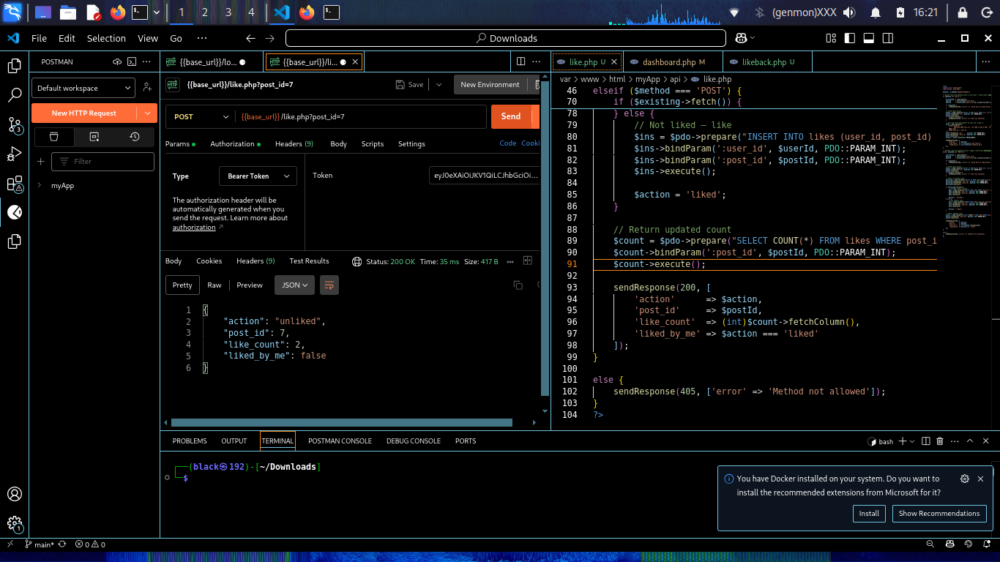